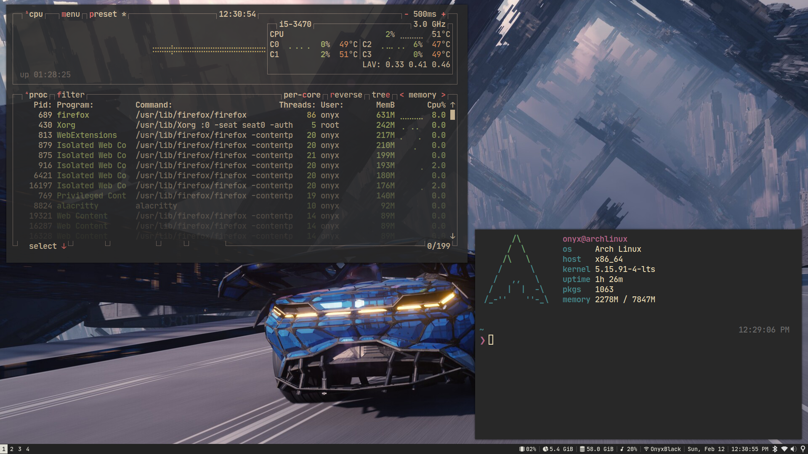
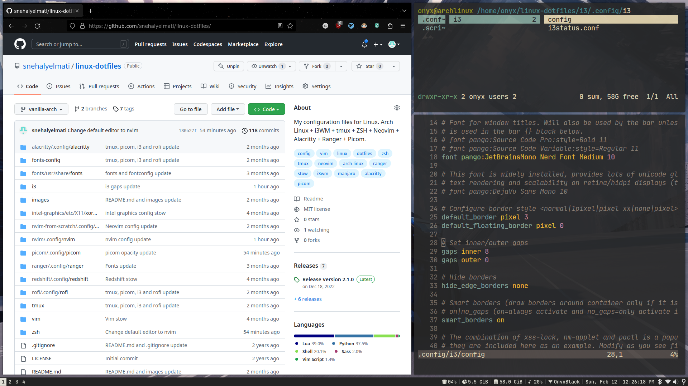
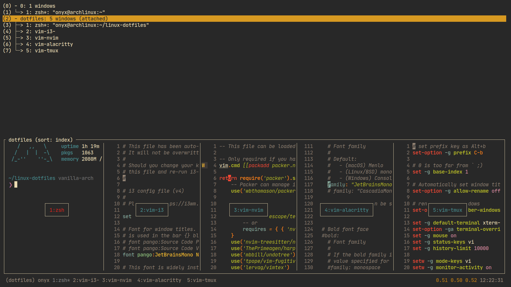

# dotfiles

My Linux dotfiles, I use [Arch](https://archlinux.org/) btw.

_Note: if you want to give these dotfiles a try, you should fork this repo, review the code and remove things you don't want or need. Use at your own risk._

- [`i3WM`](https://github.com/i3/i3) - A tiling window manager for X11.
- [`tmux`](https://github.com/tmux/tmux) - A terminal multiplexer, runs on OpenBSD, FreeBSD, NetBSD, Linux, macOS and Solaris.
- [`zsh`](https://github.com/zsh-users/zsh) - Highly customizable interactive login shell and command interpreter for shell scripting.
  - [`Oh My Zsh`](https://github.com/ohmyzsh/ohmyzsh) - Oh My Zsh is an open source, community-driven framework for managing your zsh configuration.
  - [`p10k`](https://github.com/romkatv/powerlevel10k) - Powerlevel10k is a theme for Zsh.
  - [`autosuggestions`](https://github.com/zsh-users/zsh-autosuggestions) - Fish-like fast/unobtrusive autosuggestions for zsh.
  - [`syntax-highlighting`](https://github.com/zsh-users/zsh-syntax-highlighting) - Fish shell-like syntax highlighting for Zsh.
- [`neovim`](https://neovim.io/) - Hyperextensible Vim-based text editor.
  - [`lsp-zero`](https://github.com/VonHeikemen/lsp-zero.nvim) - LSP quick start.
  - [`mason`](https://github.com/williamboman/mason.nvim) - Portable package manager for Neovim.
  - [`telescope`](https://github.com/nvim-telescope/telescope.nvim) - A highly extensible fuzzy finder built with Lua.
  - [`treesitter`](https://tree-sitter.github.io/tree-sitter/) - Tree-sitter is a parser generator tool and an incremental parsing library, built with Rust.
  - [`harpoon`](https://github.com/ThePrimeagen/harpoon) - Highly customizable folder/file/terminal navigation utility.
- [`nvim-from-scratch`](https://neovim.io/) - Neovim config based on Neovim-from-scratch series.
  - [`nvim-lspconfig`](https://github.com/neovim/nvim-lspconfig) - Quickstart configurations for the Nvim LSP client.
  - [`telescope`](https://github.com/nvim-telescope/telescope.nvim) - A highly extensible fuzzy finder built with Lua.
  - [`treesitter`](https://tree-sitter.github.io/tree-sitter/) - Tree-sitter is a parser generator tool and an incremental parsing library, built with Rust.
  - [`nvim-tree`](https://github.com/kyazdani42/nvim-tree.lua) - A file explorer tree written in Lua.
  - [`null-ls`](https://github.com/jose-elias-alvarez/null-ls.nvim) - null-ls helps to inject LSP diagnostics, code actions, and more via Lua.
  - [`gitsigns`](https://github.com/lewis6991/gitsigns.nvim) - Super fast git decorations for neovim implemented purely in lua/teal.
  - [`gruvbox-material`](https://github.com/sainnhe/gruvbox-material) - A modified version of gruvbox colorscheme with softer colors.
- [`vim`](https://github.com/vim/vim) - Vim is a free and open-source text editor which is highly configurable, built to make creating and changing any kind of text very efficient.
  - [`ctrlp`](https://github.com/ctrlpvim/ctrlp.vim) - Full path fuzzy file, buffer, mru, tag, ... finder for Vim.
  - [`YouCompleteMe`](https://github.com/ycm-core/YouCompleteMe) - A code-completion engine for Vim.
  - [`vim-airline`](https://github.com/vim-airline/vim-airline) - A customizable statusbar/tabline for Vim.
  - [`gruvbox`](https://github.com/morhetz/gruvbox) - A retro color theme for Vim.
- [`alacritty`](https://github.com/alacritty/alacritty) - A fast, cross-platform, OpenGL terminal emulator. Supported platforms: BSD, Linux, macOS and Windows.
- [`ranger`](https://github.com/ranger/ranger) - A VIM-inspired filemanager for the console.
- [`picom`](https://github.com/yshui/picom/tree/next) - A standalone compositor for X11.
- [`redshift`](https://github.com/jonls/redshift) - Redshift adjusts the color temperature of your screen according to your surroundings.
- [`pfetch`](https://github.com/dylanaraps/pfetch) - A minimal system information tool written in POSIX sh.

## Screenshots








## Pre-requisites

- [GNU Stow](https://www.gnu.org/software/stow/) to manage dotfiles/configurations.
- The dotfiles directory should be in **_home_** (for example, ~/dotfiles) to avoid additional flags like `--target`, though it is unavoidable when we have to stow files in a specific directory like **_root_** .

## Installation

Configuration can be done using the following commands,

```
// default: to stow dotfiles w.r.t the home folder
$ stow nvim

// to stow dotfiles w.r.t a specific folder, e.g root
$ stow --target=/ intel-graphics
```

### Important Notes

- All the folders in the repo **_except_** the `images` folder can be stowed, it has the images for the `README.md` file.
- Following folders have to be stowed from the **_root_** directory,
  - `intel-graphics` - config file to fix screen-tearing on Arch based systems, to be used with [xf86-video-intel](https://gitlab.freedesktop.org/xorg/driver/xf86-video-intel) driver. Refer to this section in the [ArchWiki](https://wiki.archlinux.org/title/intel_graphics#Xorg_configuration) for more details.
  - `fonts` - `/usr/share/fonts` to make fonts available for all users.
- All the other folders except the ones mentioned above can be stowed from the **_home_** directory.

## References

- [Mathias’s dotfiles](https://github.com/mathiasbynens/dotfiles)
- [Webpro's dotfiles](https://github.com/webpro/awesome-dotfiles)
- [Neovim from Scratch by chris@machine](https://www.youtube.com/playlist?list=PLhoH5vyxr6Qq41NFL4GvhFp-WLd5xzIzZ)
- [Neovim RC From Scratch by ThePrimeagen](https://www.youtube.com/watch?v=w7i4amO_zaE)
