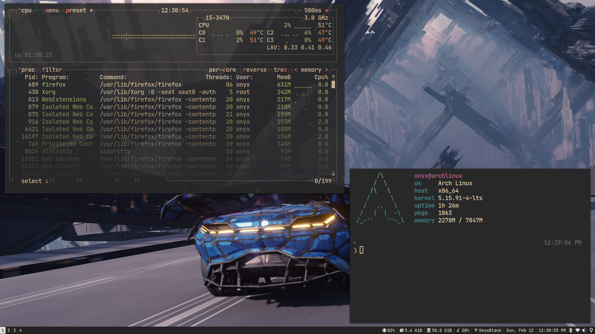
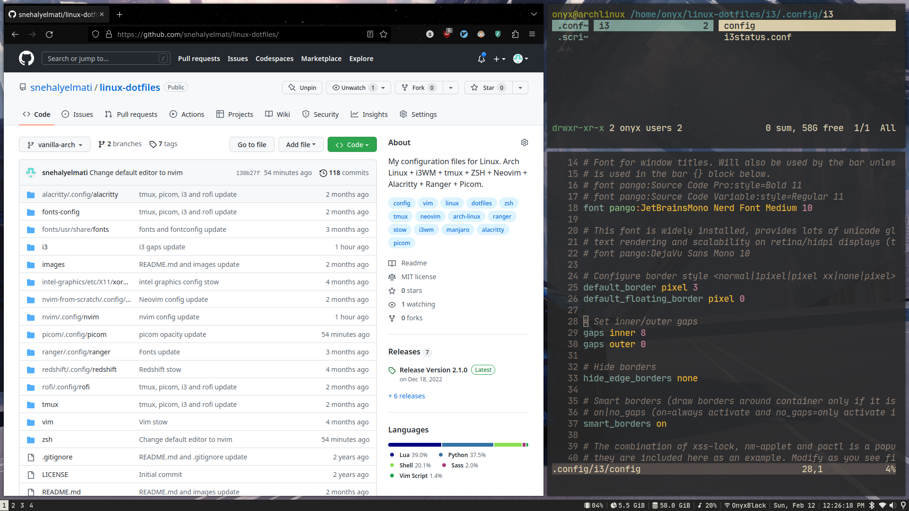
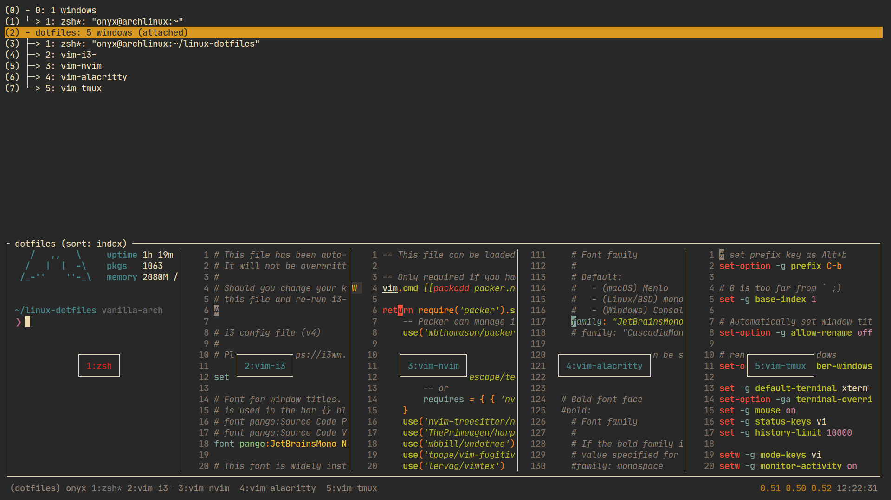

# dotfiles

Cross-platform dotfiles for macOS and Arch Linux systems, managed with [GNU Stow](https://www.gnu.org/software/stow/).

_Note: If you want to give these dotfiles a try, you should fork this repo, review the code and remove things you don't want or need._

## Tools & Configurations

### Cross-Platform Tools

- [`neovim`](https://neovim.io/) - Hyperextensible Vim-based text editor (kickstart.nvim configuration)
  - **Plugin Manager**: [`lazy.nvim`](https://github.com/folke/lazy.nvim) - Modern plugin manager with lazy loading
  - **LSP & Completion**:
    - [`mason.nvim`](https://github.com/williamboman/mason.nvim) - Automatic LSP/tool installer
    - [`blink.cmp`](https://github.com/saghen/blink.cmp) - Modern completion engine
    - [`LuaSnip`](https://github.com/L3MON4D3/LuaSnip) - Snippet engine
    - Pre-configured LSPs: `basedpyright` (Python), `lua_ls` (Lua)
  - **Navigation & Search**:
    - [`telescope.nvim`](https://github.com/nvim-telescope/telescope.nvim) - Fuzzy finder with FZF native
    - [`which-key.nvim`](https://github.com/folke/which-key.nvim) - Key mapping hints
  - **Code Enhancement**:
    - [`treesitter`](https://tree-sitter.github.io/tree-sitter/) - Syntax highlighting and parsing
    - [`conform.nvim`](https://github.com/stevearc/conform.nvim) - Formatting with ruff (Python), stylua (Lua)
    - [`gitsigns.nvim`](https://github.com/lewis6991/gitsigns.nvim) - Git integration and decorations
  - **Key Mappings**: Leader key (Space), `jk` → Escape, Vim-style navigation, system clipboard integration
- [`vim`](https://github.com/vim/vim) - Legacy Vim configuration
  - [`ctrlp`](https://github.com/ctrlpvim/ctrlp.vim) - Full path fuzzy file finder
  - [`YouCompleteMe`](https://github.com/ycm-core/YouCompleteMe) - Code-completion engine
  - [`vim-airline`](https://github.com/vim-airline/vim-airline) - Customizable statusbar/tabline
  - [`gruvbox`](https://github.com/morhetz/gruvbox) - Retro color theme
- [`tmux`](https://github.com/tmux/tmux) - Terminal multiplexer with custom scripts
  - **Configuration**: Vim-style navigation, mouse support, custom status bar
  - **Key Features**: Alt+h/l window switching, project-specific session scripts
  - **Scripts**: Automated session management (`dotfiles-tmux`, `studio-tmux`, etc.)
- [`zsh`](https://github.com/zsh-users/zsh) - Shell with advanced configuration and performance optimization
  - **Framework**: [`Oh My Zsh`](https://github.com/ohmyzsh/ohmyzsh) with optimized plugin loading
  - **Theme**: [`Powerlevel10k`](https://github.com/romkatv/powerlevel10k) - Pure-style configuration with instant prompt
  - **Performance Plugins**:
    - `evalcache` - Caches slow command evaluations for faster startup
    - `zsh-nvm` - Node.js version manager with lazy loading
  - **Enhancement Plugins**:
    - [`zsh-autosuggestions`](https://github.com/zsh-users/zsh-autosuggestions) - Fish-like command suggestions
    - [`zsh-syntax-highlighting`](https://github.com/zsh-users/zsh-syntax-highlighting) - Real-time syntax highlighting
    - `zsh-completions` - Additional completion definitions
  - **Development Environment**:
    - **Go**: Complete setup (GOPATH, GOOS=darwin, personal workspace)
    - **Python**: Python 3.9, UV package manager with completion
    - **Node.js**: NVM with lazy loading and bash completion
    - **Tools**: Protobuf compiler, IntelliJ toolbox, .NET tools, direnv integration
- [`alacritty`](https://github.com/alacritty/alacritty) - Fast, cross-platform OpenGL terminal emulator
  - **Font**: JetBrainsMono Nerd Font (size 18) - **Required for optimal display**
  - **Theme**: Gruvbox color scheme with dark background (`#1d2020`)
  - **Features**: Cursor blinking, buttonless decorations (macOS), Option-as-Alt support
  - **Shell Integration**: Zsh with login arguments, 10px horizontal padding
- [`ranger`](https://github.com/ranger/ranger) - VIM-inspired console file manager

### macOS-Specific Tools

- [`yabai`](https://github.com/koekeishiya/yabai) - Tiling window manager based on binary space partitioning
  - **Layout**: BSP (Binary Space Partitioning) with no padding/gaps
  - **Configuration**: Mouse follows focus disabled, Alt modifier for mouse actions
  - **Exclusions**: System Settings, Calculator, Karabiner-Elements, and utility apps
- [`skhd`](https://github.com/koekeishiya/skhd) - Simple hotkey daemon with comprehensive keybindings
  - **Window Focus**: `Cmd + hjkl` for directional focus
  - **Window Management**:
    - `Shift + Cmd + M` - Toggle zoom fullscreen
    - `Shift + Cmd + R` - Balance space layout
    - `Shift + Cmd + Ctrl + hjkl` - Swap windows
  - **Multi-Display**: `Ctrl + Alt + hjkl` for display focus, `Alt + Shift + hjkl` for moving windows
  - **Workspaces**: `Ctrl + Cmd + [1-0]` for moving windows between spaces
  - **Resizing**: `Shift + Alt + o/i` for horizontal window resizing
- [`aerospace`](https://github.com/nikitabobko/AeroSpace) - Alternative tiling window manager
- [`rectangle`](https://rectangleapp.com/) - Window management utility

### Linux-Specific Tools

- [`i3WM`](https://github.com/i3/i3) - Tiling window manager for X11
- [`polybar`](https://github.com/polybar/polybar) - Fast and easy-to-use status bar
- [`rofi`](https://github.com/davatorium/rofi) - Window switcher and application launcher
- [`picom`](https://github.com/yshui/picom) - Standalone compositor for X11
- [`redshift`](https://github.com/jonls/redshift) - Blue light filter for X11

### System Configuration

- `fonts` - Custom fonts for system-wide installation
- `fonts-config` - Font configuration and .Xresources
- `intel-graphics` - Intel graphics driver configuration for Arch Linux

## Screenshots - Linux








## Prerequisites

### Required Tools
- [GNU Stow](https://www.gnu.org/software/stow/) - For managing symlinks to configuration files

### Platform-Specific Dependencies

**macOS:**
```bash
# Install Homebrew if not already installed
/bin/bash -c "$(curl -fsSL https://raw.githubusercontent.com/Homebrew/install/HEAD/install.sh)"

# Install essential tools
brew install neovim tmux zsh stow yabai skhd
```

**Arch Linux:**
```bash
# Install essential tools
sudo pacman -S neovim tmux zsh stow i3-wm i3status polybar rofi

# Install AUR helper (yay) for additional packages
git clone https://aur.archlinux.org/yay.git
cd yay && makepkg -si
```

### Shell Setup (Both Platforms)
```bash
# Install Oh My Zsh
sh -c "$(curl -fsSL https://raw.github.com/ohmyzsh/ohmyzsh/master/tools/install.sh)"

# Install Powerlevel10k theme
git clone --depth=1 https://github.com/romkatv/powerlevel10k.git ${ZSH_CUSTOM:-$HOME/.oh-my-zsh/custom}/themes/powerlevel10k

# Install zsh plugins
git clone https://github.com/zsh-users/zsh-autosuggestions ${ZSH_CUSTOM:-~/.oh-my-zsh/custom}/plugins/zsh-autosuggestions
git clone https://github.com/zsh-users/zsh-syntax-highlighting.git ${ZSH_CUSTOM:-~/.oh-my-zsh/custom}/plugins/zsh-syntax-highlighting
```

## Installation

### Setup Location
Clone this repository to your home directory:
```bash
cd ~
git clone https://github.com/your-username/linux-dotfiles.git dotfiles
cd dotfiles
```

### Install Configurations

**Essential Development Environment (All Platforms):**
```bash
stow nvim-kickstart   # Current Neovim configuration
stow tmux            # Terminal multiplexer
stow zsh             # Shell configuration
stow alacritty       # Terminal emulator
stow vim             # Legacy Vim configuration
stow ranger          # File manager
```

**macOS-Specific Configurations:**
```bash
stow yabai           # Tiling window manager
stow skhd            # Hotkey daemon
stow aerospace       # Alternative window manager
stow rectangle       # Window management utility
```

**Linux-Specific Configurations:**
```bash
stow i3              # Tiling window manager
stow polybar         # Status bar
stow rofi            # Application launcher
stow picom           # Compositor
stow redshift        # Blue light filter
```

**System-Wide Configurations (requires sudo):**
```bash
# Font installation
sudo stow --target=/ fonts

# Linux-specific system configurations
sudo stow --target=/ intel-graphics  # Intel graphics fix for Arch
sudo stow --target=/ fonts-config    # Font configuration
```

### Configuration Notes

- **Repository Location**: Place in home directory (`~/dotfiles`) to avoid `--target` flags for most configurations
- **Excluded Directories**:
  - `images/` - Contains screenshots for README
  - `.archive/` - Contains old/deprecated configurations
- **System Configurations**: `fonts`, `intel-graphics`, and `fonts-config` require system-wide installation
- **Current Neovim**: Use `nvim-kickstart` directory (not the archived configurations)

## Additional Configuration

### Post-Installation Setup

**Neovim:**
```bash
# Launch Neovim to trigger plugin installation
nvim
# Run health check
:checkhealth
```

### Updating Neovim Configuration

The Neovim configuration is based on kickstart.nvim and can be updated periodically:

```bash
# 1. Update the configuration file
# Copy the latest init.lua from kickstart.nvim repo to:
# nvim-kickstart/.config/nvim/init.lua

# 2. Reset Neovim installation (removes all plugins and data)
rm -rf ~/.local/share/nvim

# 3. Reopen Neovim - Mason will automatically reinstall everything
nvim
```

**Benefits of this workflow:**
- Updates to latest kickstart.nvim features and improvements
- Resolves plugin conflicts and installation issues
- Clean reinstall of all LSP servers and tools via Mason
- Mason automatically installs everything listed in `ensure_installed`

**Tmux:**
```bash
# Source the configuration
tmux source-file ~/.tmux.conf
# Install custom scripts (already executable)
# Scripts available: cp-tmux, deepgram-tmux, dotfiles-tmux, etc.
```

**Zsh:**
```bash
# Configure Powerlevel10k theme
p10k configure
# Restart shell to apply changes
exec zsh
```

### Customization Tips

- **Tmux Scripts**: Project-specific session scripts are available in `tmux/.scripts/`
  - Example: `dotfiles-tmux` creates windows for yabai, skhd, nvim, alacritty, and tmux configs
  - Scripts follow pattern: `<project>-tmux` with predefined window layouts
- **Window Management**:
  - macOS: Choose between `yabai`, `aerospace`, or `rectangle` based on preference
  - Linux: `i3` configuration includes custom keybindings and polybar integration
- **Neovim**: Configuration uses kickstart.nvim approach - modify `nvim-kickstart/.config/nvim/init.lua`
- **Terminal Colors**: Configurations assume 256-color terminal support
- **Font Requirements**: JetBrainsMono Nerd Font required for icons and proper display
- **Performance**: Zsh includes timing functions (`timezsh`, `timePlugins`) to monitor startup performance

### Key Bindings Quick Reference

**Neovim:**
```
Leader Key: Space
jk/JK/Jk → Escape (Insert mode)
<leader>e → File explorer
<leader>y → Copy to system clipboard
<leader>f → Format buffer
<C-hjkl> → Window navigation
```

**Tmux:**
```
Prefix: Ctrl+b
hjkl → Pane navigation
Alt+hl → Window switching
| → Split horizontal
_ → Split vertical
```

**macOS (skhd):**
```
Cmd+hjkl → Window focus
Shift+Cmd+M → Toggle fullscreen
Shift+Cmd+R → Balance layout
Ctrl+Cmd+[1-0] → Move to workspace
```

### Troubleshooting

**Common Issues:**
- **Fonts not displaying properly**: Install JetBrainsMono Nerd Font
- **Tmux colors incorrect**: Ensure `TERM='xterm-256color'` is set
- **Neovim LSP not working**: Run `:checkhealth` and `:Mason` to verify installations
- **Neovim plugin issues**: Use the reset workflow: `rm -rf ~/.local/share/nvim` then reopen nvim
- **Zsh slow startup**: Use `timezsh` function to identify slow plugins
- **Yabai not working**: Check SIP status and permissions with `yabai --check-sa`

## References

- [Kickstart.nvim](https://github.com/nvim-lua/kickstart.nvim) - Neovim configuration template
- [GNU Stow Manual](https://www.gnu.org/software/stow/manual/stow.html) - Dotfiles management
- [Yabai Documentation](https://github.com/koekeishiya/yabai/wiki) - macOS window management
- [i3 User's Guide](https://i3wm.org/docs/userguide.html) - Linux window management
- [Mathias's dotfiles](https://github.com/mathiasbynens/dotfiles) - Inspiration and best practices
- [Webpro's dotfiles](https://github.com/webpro/awesome-dotfiles) - Community dotfiles collection
